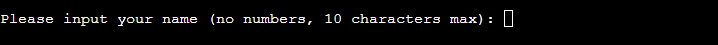

# Battleship

Welcome to my Python terminal battleship game! This game runs in the Code Institute mock terminal on [Heroku](https://id.heroku.com/login).

The users main goal is to sink all the computer's ships before the computer sinks theirs. There are 4 ships on both boards each taking up one cell.

[Here is the live version of my project]()

[View Battleship on Github pages](https://github.com/Keszi94/battleship)

### How to play

This game is based on the classic paper/board game. You can read more about it on [Wikipedia](https://en.wikipedia.org/wiki/Battleship_(game)).

* The player enters their name and two boards are randpmly generated with 4 ships on each.

* The computer's ships are hidden, while the player's ships are visible throughout the game.

* The guesses are indicated with an 'O' while hits display with an 'X'.

* In each turn the player and the computer makes a guess and try to sink the other player's ships.

* The winner is declared after one of the players lost all their ships.

I hope you will enjoy playing Battleship as much as I enjoyed creating it! Happy gaming!

- - - 

## CONTENTS
 
* [Features](#features)
   
* [Data Model](#data-model)   

* [Testing](#testing)
   * [Manual Testing](#manual-testing)
   * [Bugs](#bugs)
   * [Validator Testing](#validator-testing)

* [Deployment](#deployment) 

* [Credits](#credits)
   * [Code Used](#code-used)
   * [Content](#content)
   * [Styling](#styling)
   * [Acknowledgments](#acknowledgments)

## Features    

* Taking player's name input

*  Input validation
      
   * player can not enter numbers only letters
   * can not enter anything over 10 characters

 

* Random board generation
  * ships are randomly placed on both the player and computer boards
  * the player can not see where the computer's ships are
  * the player's ships are always visible

 

* play against the computer
* accepts user input

 

* keeps scores
   
    * To see these statements the player has to scroll up in the terminal, which can be a minor inconvenience to people who find it easier to process information by reading a string rather than seeing the visual cues on the board.  

 

* Input validation and error-checking in guess input
  * player can not enter coordinates outside the size of the grid
  * player must only enter numbers
  * can not enter the same guess twice 

 

* data maintained in class instances

- - - 

## Data Model

1. __Game Boards__ _(Class Boards)_

 * I used a class to represent the boards which helps manage the placement of the ships and the grid's structure. It ensures that ships are placed randomly on the boards at the start of the game and provides a method to also display said boards.
 * The boards for both the player and the computer are represented as 2D grids with the default size of 5x5. The grids store the ship, hits and misses locations.
 * Each cell in the grid can contain:
     * Ship: A ship is placed in th cell, displays as __'S'__
     * Hit : Result of a player/computer guess that hits a cell with a ship, displays as __'X'__
     * Miss : Result of a player/computer guess that hits an empty cell, diplays as __'O'__
     * Empty space: Means no ship or guess is present in the cell

2. __Ship Placement__ _(place_ships)_

 * Both the player and the computer have 4 ships that are placed randomly on their boards.
 * The board class handles the placement of the ships, ensuring that the ships are placed randomly, that they are all placed within the boundaries of the grid and that there are now two ships overlapping each other.

3. __Tracking Guesses__ _(player_guess, computer_guess)_

 * All guess coordinates are tracked to ensure that no location is checked more than once.
 * The guesses are stored in sets to make it easy to check if a guess has already been played or not.
 * After each guess, the board is updated to show if the guess was a miss or a hit, and then the information is displayed to the player.

4. __Managing Scores__ _(player_guess, computer_guess, check_winner)_

 * The game keeps separate scores for the player and the computer. These show the number of successful hits.
 * The score is updated after each round if a hit was made. The game continues on until one player sinks all of the other opponent's ships or if both hit 4 ships at the same time. 

5. __Restarting the Game__ _(play_again)_
 
 * At the end of each game, the player is given the option to restart. If they choose not to play, the game displays a goodbye message. If they decide to play again, the game resets the boards, ships and the scores.

6. __Complete Game Flow__ _(play_game)_
 
 * At the start, the game prints a welcome message with the rules and asks the player to input their name _(welcome_message)_. 
 * Two boards are created, both the same structure, one for the player, the other for the computer. Both boards get 4 randomly placed ships but only the player's ships are visible.
 * The gameplay consists of the player and the computer taking turns to guess a grid location on the other's board. After each guess:
    * The result of the turn is displayed on both boards and recorded (rows/columns guessed, any hits or misses). 
    * Results of each turn are also printed above the boards.  
 * The loop continues on until one player sinks all of their opponent's ships. If they do, they are declared as the winner. If both players hit the last ship on the other's board in the last round, the game is declared a tie.
 * After the outcome of the game is determined the player is given the option to play again or exit the game.  

- - - 

## Testing

I have manually tested this project by doing the following:
 * Checked my code for problems using [PEP8](https://pep8ci.herokuapp.com/).
 * Given invalid inputs: strings when numbers are expected, out of bounds inputs, repeat inputs
 * Tested in my local terminal and the Code Institute Heroku terminal

### Manual Testing

| Feature | Expected Outcome | Testing Performed | Result | Pass/Fail |
| --- | --- | --- | --- | --- |
| Player name input | Game starts, input should appear above the player's board | typed in letters only | The game started, input appeared above the player's board | Pass |
| Invalid player name input | The program should raise an error when numbers are typed in | typed in numbers spereate and with letters |  | Pass |
|  |  |  |  | Pass |
|  |  |  |  | Pass |
|  |  |  |  | Pass |
|  |  |  |  | Pass |
|  |  |  |  | Pass |
|  |  |  |  | Pass |
|  |  |  |  | Pass |
|  |  |  |  | Pass |
|  |  |  |  | Pass |
|  |  |  |  | Pass |
|  |  |  |  | Pass |
|  |  |  |  | Pass |
|  |  |  |  | Pass |
|  |  |  |  | Pass |
|  |  |  |  | Pass |
|  |  |  |  | Pass |
|  |  |  |  | Pass |
|  |  |  |  | Pass |
|  |  |  |  | Pass |

### Bugs

#### Solved Bugs

#### Known Bugs

NAME TAKES SPEC CHARACTERS isalpha()

#### Remaining Bugs

### Validator Testing

* Testing done through PEP8, no errors detected:

- - - 

## Deployment

This project was deployed using Code Institute's mock terminal for Heroku.

* Steps for deployment:
  * Fork or clone this repository
  * Create a new [Heroku](https://id.heroku.com/login) app
  * Set the buildbacks to _Python_ and _NodeJs_ in that order
  * Link the Heroku app to the repository
  * Click on __Deploy__

- - -

## Credits

### Code Used

* I used [this Youtube tutorial](https://www.youtube.com/watch?v=3uKdQx-SZ5A&t=9s) to help me with creating the game logic.

I have used the following websites to gather relevant information during my research:
* [Stackoverflow](https://stackoverflow.com/)
* [Reddit](https://www.reddit.com/)
* [Thecodingforums](https://www.thecodingforums.com/)
* [W3Schools](https://www.w3schools.com/)
* [Python.org](https://www.python.org/)

### Content

* I created my Readme file based on [Kera Cudmore's](https://github.com/kera-cudmore) [Bully Book Club](https://github.com/kera-cudmore/Bully-Book-Club) and [TheQuizArms](https://github.com/kera-cudmore/TheQuizArms) Readme files.

### Styling

I have used [colorama](https://pypi.org/project/colorama/) to make the game look visually more engaging and user-friendly by adding color to some of the text.

### Acknowledgments

I would like to acknowledge the following people who helped me along the way in completing my third milestone project:

* [Graeme Taylor](https://github.com/G-Taylor), my Code Institute Mentor.
- - -
